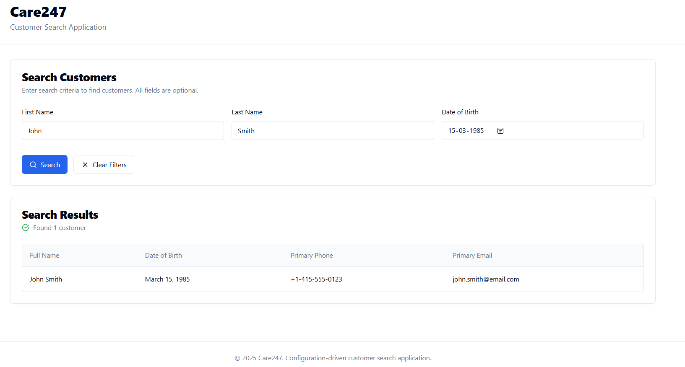

# Customer Search Application – Care247 Web Technical Assignment

A **configuration-driven customer search web app** built with **React + TypeScript + Tailwind CSS + shadcn/ui**.  
Adding or modifying search fields requires only updating the configuration object — not the component code.

---

## 🧭 Project Overview
This app allows users to search and view customer information from a mock API.  
The entire UI (search form, result table, and displayed columns) is dynamically generated from a single **configuration object**.

---

## ⚙️ Tech Stack
- **React 18 + Vite + TypeScript**
- **Tailwind CSS**
- **shadcn/ui components**
- **JSON Server** for mock API (`db.json`)
- **Axios** for API requests

---

## 🧩 Key Features
| Feature | Description |
|----------|-------------|
| 🔍 **Configuration-driven search** | Form fields (`firstName`, `lastName`, `dateOfBirth`) rendered dynamically from `searchConfig.ts`. |
| 🧱 **Reusable generic components** | `FormField`, `SearchForm`, and `ResultsTable` adapt automatically to config changes. |
| 📜 **Result Table Config** | Displayed columns (`name`, `dateOfBirth`, `primaryPhone`, `primaryEmail`) defined in config. |
| ⚡ **Mock API** | Uses `JSON Server` with `db.json` (15 sample customers). |
| 🌀 **Loading / Error / Empty states** | Handled gracefully with responsive UI feedback. |
| 🧩 **Extensible** | Adding a new field (e.g. `middleName`) only requires editing `searchConfig.ts`. |

---

## 🧱 Project Structure
```
src/
 ┣ components/
 ┃ ┣ FormField.tsx
 ┃ ┣ SearchForm.tsx
 ┃ ┗ ResultsTable.tsx
 ┣ config/
 ┃ ┗ searchConfig.ts
 ┣ types/
 ┃ ┗ customer.ts
 ┣ pages/
 ┃ ┗ SearchPage.tsx
 ┣ utils/
 ┃ ┗ api.ts
 ┗ main.tsx
db.json
vite.config.ts
tailwind.config.js
```

---

## 🚀 Getting Started

### 1️⃣ Install dependencies
```bash
npm install
```

### 2️⃣ Start the mock API server
```bash
npm run server
# or
npx json-server --watch db.json --port 3001
```
API URL → http://localhost:3001/customers

### 3️⃣ Run the application
```bash
npm run dev
```
App URL → http://localhost:5173

---

## 🧠 Configuration-Driven Approach
Example from `src/config/searchConfig.ts`:
```ts
export const searchConfig = {
  fields: {
    firstName: { uiType: 'input', label: 'First Name', placeholder: 'Enter first name', renderOrder: 1 },
    lastName:  { uiType: 'input', label: 'Last Name',  placeholder: 'Enter last name',  renderOrder: 2 },
    dateOfBirth:{ uiType: 'date', label: 'Date of Birth', renderOrder: 3 },
  },
  resultFields: ['name', 'dateOfBirth', 'primaryPhone', 'primaryEmail']
};
```

To add a new field (e.g. `middleName`), simply extend `fields` — no component code changes required.

---

## 🧩 How to Add a New Search Field
1. Open `src/config/searchConfig.ts`  
2. Add:
```ts
middleName: { uiType: 'input', label: 'Middle Name', placeholder: 'Enter middle name', renderOrder: 2 }
```
3. Restart `npm run dev` → Field appears automatically in the form.

---

## 📊 Evaluation Focus Checklist (for reviewers)
| ✅ Criterion | Evidence |
|--------------|-----------|
| Configuration Design | `searchConfig.ts` controls all UI elements. |
| Code Quality (TypeScript) | Strict typing in `types/customer.ts`. |
| Component Reusability | Generic `FormField` and `ResultsTable`. |
| UI/UX | Responsive layout + loading/error states. |
| Mock API Integration | `db.json` with 15 customers via JSON Server. |
| Documentation | Clear README + architecture notes. |

---

## 🧩 Sample Customer Data
Located in `db.json` → 15 customers with IDs, addresses, phones, and emails.

---

## 🕒 Time Spent
**≈ 13.5 hours total**
- Planning and config schema → 1 h  
- Component creation → 9 h  
- Testing and debugging → 2 h  
- Documentation and README → 1.5 h  

---

## 🖼️ Screenshots

| Screen | Image |
|---------|--------|
| Search Form – Empty State |  |
| Search Form – Before Search |  |
| Search Results – After Search |  |

---

## 🧩 Reviewer Testing Scenarios
1. Run `npm run server` and `npm run dev`.  
2. Search by First Name = `John` → Should return John Smith.  
3. Search by Last Name = `Brown` → Should return James Brown.  
4. Search by DOB = `1988-06-19` → Should return Lisa Martinez.  
5. Clear Filters → Resets form and results.  
6. Turn off server → Error state appears.  

---

## 🧩 Trade-offs & Decisions
- Focused on config driven architecture over complex state management.  
- Used simple local state + Axios for clarity.  
- Avoided third-party form libraries to keep components generic and lightweight.

---

## 🧩 Future Improvements
- Add pagination for large datasets.  
- Integrate unit tests for config parser and API calls.  
- Support exporting results to CSV.

---

## 🧑‍💻 Author
**Rishik Kumar Chaurasiya**  
---
